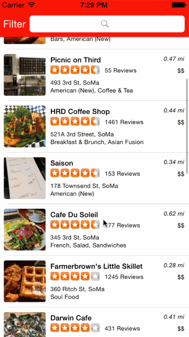

# Project: Yelp

This is an iOS demo application for searching and filtering restaurants using the [Yelp API] (http://www.yelp.com/)

Time spent: About 18 hours 

Completed user stories:

Search results page - 

* [x] Required: Table rows should be dynamic height according to the content height
* [x] Required: Custom cells should have the proper Auto Layout constraints
* [x] Required: Search bar should be in the navigation bar 

Filter page - 

* [x] Required: The filters you should actually have are: category, sort (best match, distance, highest rated), radius (meters), deals (on/off).
* [x] Required: The filters table should be organized into sections as in the mock.
* [x] Required: Clicking on the "Search" button should dismiss the filters page and trigger the search w/ the new filter settings.
* [x] Optional: Implement a custom switch
* [x] Optional: Categories should show a subset of the full list with a "See All" row to expand.
* [x] Optional: Radius filter should expand as in the real Yelp app

Not completed stories - 

* [ ] Optional: Implement the restaurant detail page.
* [ ] Optional: Infinite scroll for restaurant results
* [ ] Optional: Implement map view of restaurant results

Notes:

Spent a lot of time setting up the underlying filters model.
Had to fix lots of bugs for NSUserDefaults.
Getting the collapse and expand to work for the filters view was time consuming.

This was a great learning experience, learnt about autolayout, setting up user forms by hand, table views with sections.

3rd party libraries used:

SVProgressHUD
AFNetworking
BDBOAuth1Manager

Walkthrough of all user stories:

GIF created with [LiceCap](http://www.cockos.com/licecap/).
